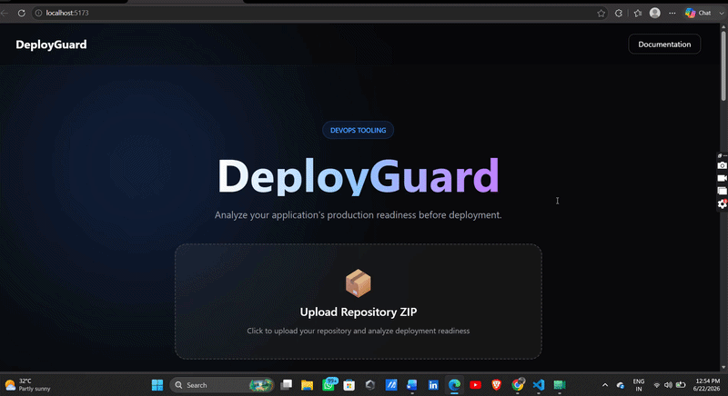

# DeployGuard



## Deployment Readiness Analyzer

DeployGuard analyzes repositories before deployment and generates deployment readiness scores, CI/CD recommendations, Docker validation checks, and environment configuration assessments.

### Features

- ZIP Repository Upload
- Deployment Readiness Scoring
- Dockerfile Detection
- GitHub Actions Detection
- Package.json Analysis
- Environment Variable Validation
- DevOps Recommendations
- JSON Report Export

### Tech Stack

Frontend:
- React
- Tailwind CSS
- Framer Motion
- Axios

Backend:
- Node.js
- Express
- Multer
- Adm-Zip

### Workflow

Repository Upload

↓

Repository Extraction

↓

Deployment Analysis

↓

Readiness Score Generation

↓

Recommendations Dashboard

## Example Report

```json
{
  "score": 70,
  "status": "Needs Improvement",
  "missingFiles": [
    "Dockerfile"
  ],
  "recommendations": [
    "Add Dockerfile",
    "No GitHub Actions workflow detected"
  ]
}
```

## Future Enhancements

* Kubernetes Configuration Analysis
* Health Endpoint Detection
* Terraform Validation
* Docker Compose Analysis
* Cloud Deployment Recommendations

---

## Author

Aditya Desai
